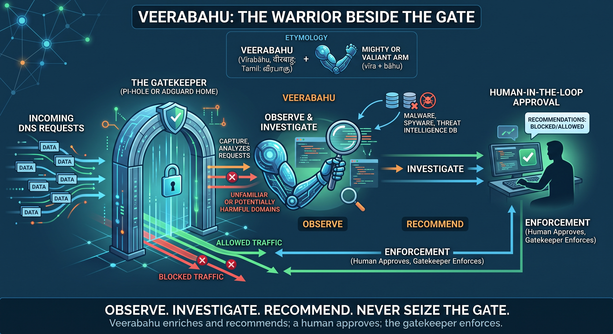

>
> You can call it an AI-Slop.
> But the thought behind it is a human's.
> 

# Veerabahu

Veerabahu is a local, human-in-the-loop enrichment sidecar for Pi-hole and
AdGuard Home. It reads resolved domains, publishes an approved blocklist, and
never writes to the gatekeeper API.

## Etymology

**Veerabahu** (Sanskrit: _Vīrabāhu_, वीरबाहु; Tamil: வீரபாகு, _Vīrapāku_) is a name associated with a warrior and commander in the traditions surrounding **Murugan (Skanda/Kartikeya)**, the Hindu god of war. The name can be understood from _vīra_, meaning **brave, heroic, or warrior**, and _bāhu_, meaning **arm**, conveying the sense of a **mighty or valiant arm**.

<p align="center">
  
</p>

> _Veerabahu_ — "valorous arm." In the Kanda Puranam, Murugan's commander and
> envoy, sent ahead to scout Surapadman's fortress and report back. He gathers
> intelligence and advises; the strike belongs to his commander. So does this
> sidecar: it enriches and recommends, the gatekeeper blocks, you approve.

The name reflects Veerabahu's role in this project.



Pi-hole or AdGuard Home remains the **gatekeeper**: it ultimately decides what DNS requests are allowed or blocked. Veerabahu does not take over that authority. Instead, it stands alongside the gatekeeper, observing the domains that pass through, investigating unfamiliar or potentially harmful ones, and preparing intelligence that the gatekeeper can consume.

Like its namesake, Veerabahu is therefore not the ruler of the gate. It is the **warrior beside it**: gathering intelligence, identifying threats, and presenting them for deliberate action.

That distinction is also central to the project's human-in-the-loop philosophy. Veerabahu enriches and recommends; a human approves; the gatekeeper enforces.

**Observe. Investigate. Recommend. Never seize the gate.**

## Docker deployment

1. Copy the example environment and create the encryption key. The key is
   required to decrypt settings stored in the database and must be kept in the
   deployment secret store:

   ```sh
   cp .env.example .env
   openssl rand -base64 32
   ```

   Put the generated value in `VB_MASTER_KEY` in `.env`. Do not commit `.env`,
   print the key in logs, or paste it into support output. The application
   validates that it decodes to exactly 32 bytes.

2. Start the process and open <http://localhost:3000>:

   ```sh
   docker compose up -d --build
   ```

3. On first run, Veerabahu redirects to onboarding. Create the local admin
   password, configure the Pi-hole or AdGuard Home read-only connection, test
   it, choose reputation sources and quotas, then review and activate. Settings
   and credentials are stored in the encrypted application database; the
   environment file supplies the master-key and process/database bootstrap
   only.

## Upgrading an existing Compose deployment

Keep your existing `.env` and database volume. Add `VB_MASTER_KEY` to that
environment file, then start once with the legacy import override:

```sh
docker compose -f docker-compose.yml -f docker-compose.legacy.yml up -d --build
```

The override passes the existing `.env` runtime values into the container;
ordinary Compose `.env` interpolation alone does not do that. The app imports
them only when no `app_config` row exists and leaves onboarding incomplete.
Open the app, create the admin password, review the imported configuration,
test the gatekeeper, and activate. A positive AI daily budget requires both
input and output prices; set the legacy price variables before importing if
you previously configured a budget without prices.

After onboarding, switch back to the normal Compose file:

```sh
docker compose up -d --force-recreate
```

You can then remove the old runtime variables from `.env`, keeping the same
master key and process/database bootstrap values. Saved database settings take
precedence on later starts. Run one Veerabahu app process per database; settings
saves and scheduler transitions are serialized within that process.

## Local recovery: reset-and-onboard

There is no remote or forgotten-password reset. For a local SQLite deployment,
stop Veerabahu, archive the named database volume, replace only that exact
volume, and start with the deployment's `VB_MASTER_KEY`. Run these commands
from the project directory; the volume filter avoids guessing Compose's
project-name prefix:

```sh
set -eu
docker compose stop veerabahu
docker compose rm -f veerabahu
DATA_VOLUME="$(docker volume ls --filter label=com.docker.compose.volume=veerabahu-data --format '{{.Name}}')"
test -n "$DATA_VOLUME"
docker run --rm -v "$DATA_VOLUME":/data -v "$PWD":/backup alpine \
  tar czf /backup/veerabahu-data-backup.tgz -C /data .
docker volume rm "$DATA_VOLUME"
docker compose up -d --build
```

`test -n` must succeed before the volume command runs; never substitute a
workspace path or an unverified volume name. The archive is the recoverable
backup. Open the app and complete onboarding again, then keep the archive until
the new configuration is verified. Restore it under deployment control if
needed. Do not change or expose the master key during recovery.

## Gatekeeper and adlist refresh

The gatekeeper connection is read-only: Veerabahu pulls resolved-domain data
for enrichment and does not push rules or change gatekeeper settings. After
activation, configure the gatekeeper to subscribe to Veerabahu's published
adlist at:

```text
http://<veerabahu-host>:3000/blocklist.txt
```

Set Pi-hole or AdGuard Home to refresh that adlist on its own schedule; an
approximately hourly refresh is recommended. Veerabahu cannot force a
gatekeeper refresh. The public blocklist endpoint remains unauthenticated so
the gatekeeper can pull it.

## Configuration reference

`.env.example` contains only the master key and process/database bootstrap
values. Configure gatekeeper credentials, source credentials, quotas, scoring,
and scheduler settings through the authenticated Settings page after
onboarding.

Curated lists require at least one list URL, or you must disable that source
and configure another. No lists are bundled. When an AI daily cost ceiling is
positive, enter both token prices so calls contribute to the budget. The
published endpoint is fixed at `/blocklist.txt`, including after legacy import.
